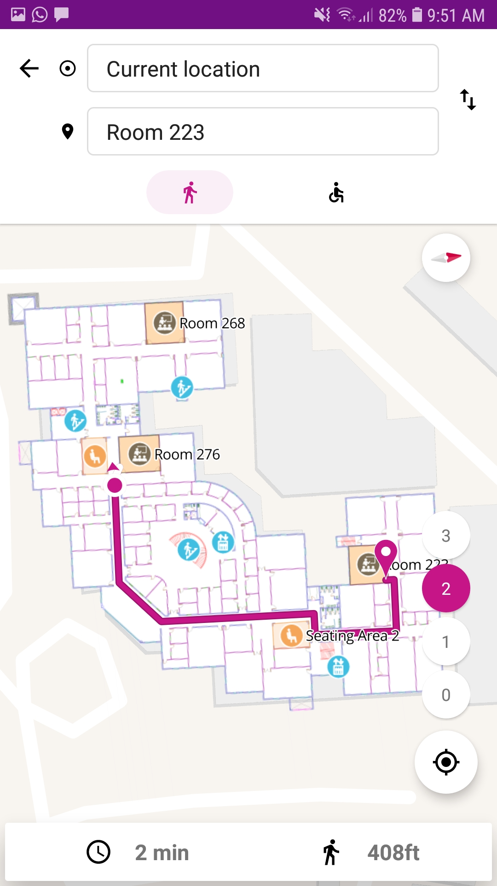

# Indoor-Navigation
An indoor navigation app built for BITS Pilani Dubai Campus.

The app allows users to navigate from their current location to any room on campus. The user location is esimated by using WiFi RSSI trilaterateration methods, and then routing is done using the A* algorithm to find the shortest path to the destination.

To run the app, simply:
* Install the [apk](https://github.com/shaunferns26/Indoor-Navigation/releases)
* Grant location permisions
* Turn on WiFi and Location in settings.

## Preview

    
     
    Application routing user to room 223

